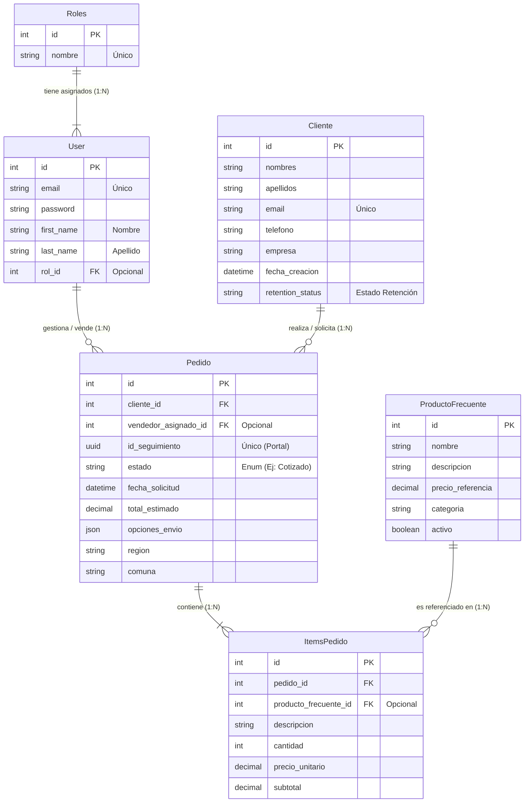

# Diagrama MER - Proyecto Clarotec

Para visualizar este diagrama, puedes usar la vista previa de Markdown en VS Code (`Ctrl+Shift+V`) si tienes una extensión compatible con Mermaid, o copiar el código de abajo en [Mermaid Live Editor](https://mermaid.live/).

